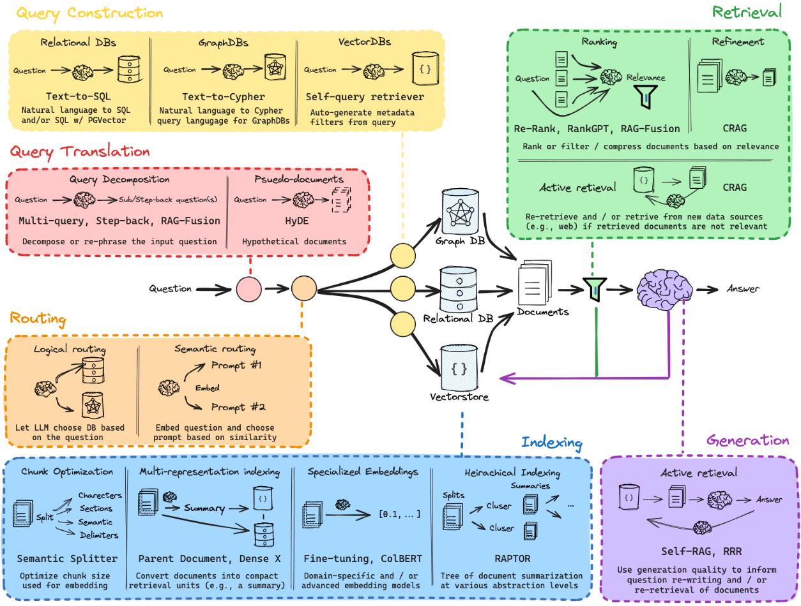

  

# RAG-from-scratch

## Project Overview
This project implements Retrieval-Augmented Generation (RAG) from scratch. RAG is an approach that enhances language generation tasks by incorporating a retrieval mechanism, allowing the model to pull relevant information from a separate knowledge base to generate more accurate and contextually relevant responses. This project provides a detailed, step-by-step guide to building RAG, covering data retrieval, embedding generation, and integrating retrieval with generation.

## Approach
The project follows a multi-step approach, designed to gradually build and refine the RAG model:

* Data Preparation:

  * Establishes a dataset of documents that serve as the knowledge base for the retrieval component.
  * Preprocesses the data, transforming it into a format that supports efficient search and retrieval, including embedding generation for each document.
* Embedding Generation:

  * Implements embeddings for both queries and documents, allowing the model to retrieve relevant documents based on semantic similarity.
  * Embeddings are generated using pretrained models, providing a foundation for the retrieval mechanism to match queries with appropriate documents.
* Retrieval Mechanism:

  * The retrieval system identifies the most relevant documents for a given input query by calculating the similarity between query and document embeddings.
  * This component forms the backbone of the RAG architecture, ensuring that the generation process has access to relevant contextual information.
* Generation Model:

  * A language generation model is integrated with the retrieval component, allowing it to generate responses conditioned on the retrieved information.
  * Combines traditional language generation with retrieval-based augmentation, enhancing the model’s ability to produce accurate and informative responses.
* Fine-Tuning and Optimization:

  * Fine-tunes the retrieval and generation models on a custom dataset to improve performance.
  * Optimizes parameters such as retrieval depth and generation length to balance accuracy with efficiency.
## Results and Future Work
* Model Performance: The RAG model demonstrates improved response relevance by utilizing external knowledge during generation.
* Future Directions:
  * Experiment with alternative retrieval mechanisms, such as dense passage retrieval, to further refine document selection.
  * Explore additional embedding models and retrieval approaches to increase the relevance and accuracy of generated responses.
